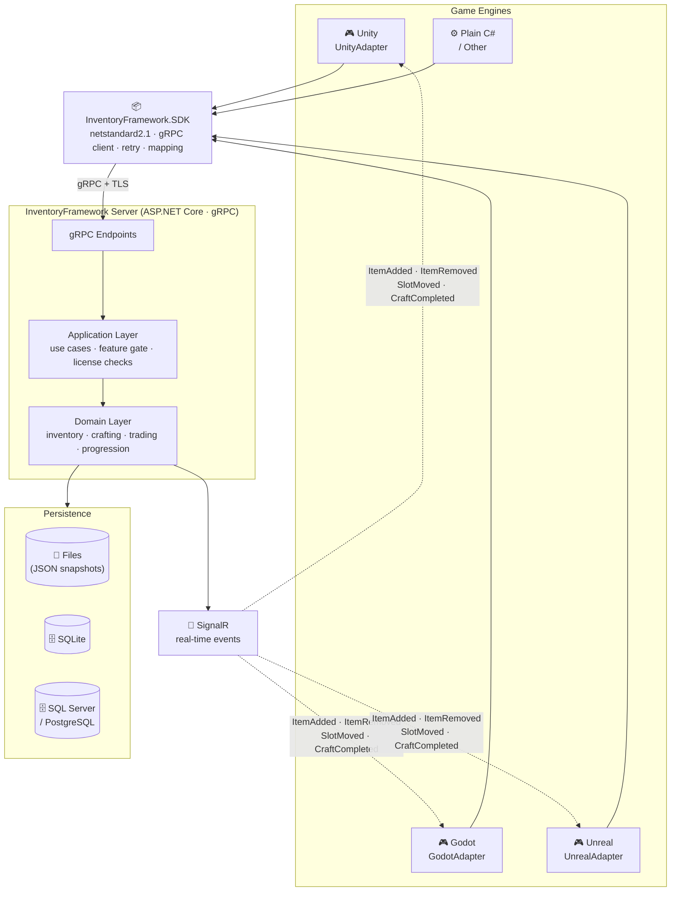
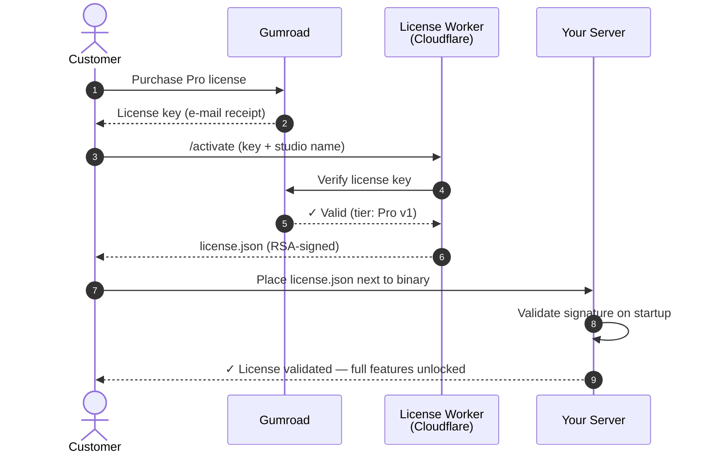
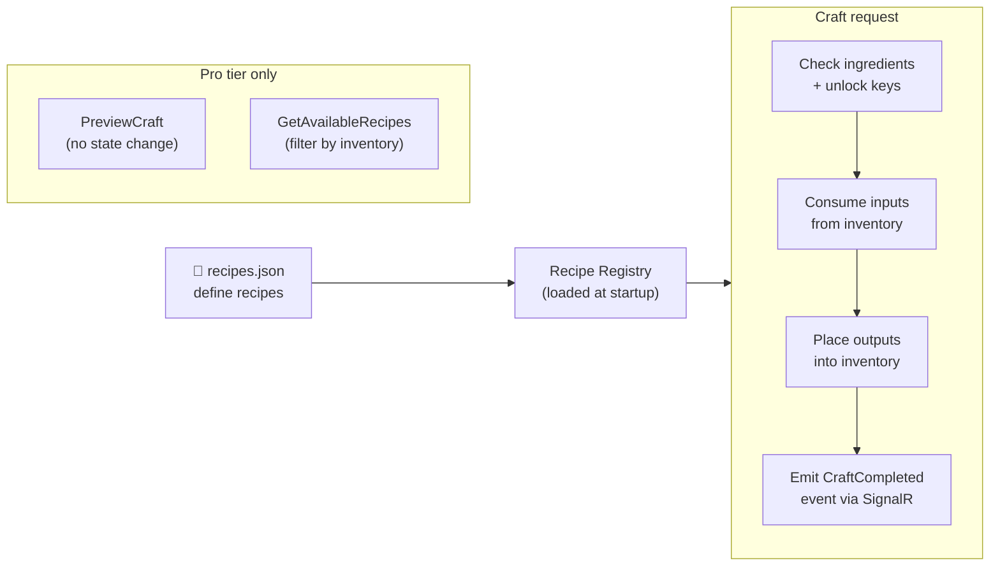

# InventoryFramework

[](https://www.nuget.org/packages/InventoryFramework.SDK)
[](https://www.nuget.org/packages/InventoryFramework.UnityAdapter)
[](https://www.nuget.org/packages/InventoryFramework.GodotAdapter)
[](https://www.nuget.org/packages/InventoryFramework.UnrealAdapter)
[](mailto:mbaltuncay99@gmail.com)

**Server-authoritative inventory and crafting backend for Unity, Godot, and Unreal Engine.**

One server, three engines, zero vendor lock-in. Define your items in JSON, run the server, connect from any engine in under 10 minutes.

> Full documentation: **[https://b-altuncay.github.io/InventoryFramework](https://b-altuncay.github.io/InventoryFramework)**

---

## Why InventoryFramework?

Unity's inventory solutions — whether built-in or from the Asset Store — are client-side. That works fine for single-player. The moment you add multiplayer, leaderboards, or a second platform, you hit the same wall every time: the data lives on the client, players can modify it, and syncing it across engines is a custom project of its own.

InventoryFramework takes a different approach:

- **All state lives on your server.** Players cannot modify their own inventory outside your game logic. No client-side hacks, no save file editing.
- **One backend, any engine.** The same server talks to Unity, Godot, and Unreal simultaneously. Switch engines mid-project or ship on multiple platforms without rewriting your inventory logic.
- **Self-hosted.** Your player data never touches a third-party service. No per-MAU pricing, no outage dependencies, no terms-of-service changes that break your game.
- **Drop-in ready.** Item definitions are plain JSON files. The server runs as a single binary. You don't need to write a single line of backend code to get started.

---

## Architecture



---

## Get it running in 10 minutes

### 1. Download the server

Grab the latest pre-built binary from [GitHub Releases](https://github.com/b-altuncay/InventoryFramework/releases):

```
InventoryFramework-Server-Demo-win-x64.zip    (Windows)
InventoryFramework-Server-Demo-linux-x64.zip  (Linux)
```

Extract and run:

```bash
# Windows
start-demo.bat

# Linux
chmod +x start-demo.sh && ./start-demo.sh
```

The server starts at `https://localhost:7289`.

### 2. Define your items

Create `Data/Items/items.json` next to the binary:

```json
[
  { "id": "wood",  "displayName": "Wood",       "maxStackSize": 50, "weight": 1.0 },
  { "id": "sword", "displayName": "Iron Sword",  "maxStackSize": 1,  "weight": 3.0,
    "hasDurability": true, "maxDurability": 100 }
]
```

### 3. Install the client SDK

```bash
dotnet add package InventoryFramework.UnityAdapter   # Unity
dotnet add package InventoryFramework.GodotAdapter   # Godot
dotnet add package InventoryFramework.UnrealAdapter  # Unreal
dotnet add package InventoryFramework.SDK            # Plain C#
```

### 4. Connect and add items

```csharp
var facade = new UnityInventoryFacade(new UnityInventoryConfiguration
{
    ServerAddress = "https://localhost:7289",
    ApiKey        = "sk-game-your-key",
    ActorId       = "player-001"
});

await facade.CreateDefaultInventoryAsync();
await facade.GrantItemsAsync(containerId, "wood", 10);

var snapshot = await facade.RefreshAsync();
Debug.Log($"Items in backpack: {snapshot.Containers[0].Slots.Count(s => !s.IsEmpty)}");
```

Same lines work on Godot and Unreal — just swap the facade class name.

---

## Feature tiers

| | Demo | Pro | Enterprise |
|---|:---:|:---:|:---:|
| Pre-built server binary (Windows & Linux) | ✓ | ✓ | ✓ |
| File-based persistence | ✓ | ✓ | ✓ |
| SQLite persistence | | ✓ | ✓ |
| SQL Server / PostgreSQL | | | ✓ |
| Unity · Godot · Unreal adapters | ✓ | ✓ | ✓ |
| Full inventory management (CRUD, merge, split, sort, drop) | ✓ | ✓ | ✓ |
| Crafting system (basic) | ✓ | ✓ | ✓ |
| Craft preview & recipe availability | | ✓ | ✓ |
| Item affixes (per-instance rolled modifiers) | ✓ | ✓ | ✓ |
| Player progression / recipe unlock keys | | ✓ | ✓ |
| Trading system | | ✓ | ✓ |
| QuickStore | | ✓ | ✓ |
| Real-time events via SignalR | ✓ | ✓ | ✓ |
| Docker + docker-compose | ✓ | ✓ | ✓ |
| Rate limiting & API key auth | ✓ | ✓ | ✓ |
| Max actors | 3 | Unlimited | Unlimited |
| Max items per actor | 50 | Unlimited | Unlimited |
| Max slots per container | 20 | Unlimited | Unlimited |
| Studio license | — | Single studio | Multi-studio |
| Support | — | E-mail | Priority + SLA |
| **Pricing** | Free | [Buy license →](https://inventoryframework-license.mbaltuncay99.workers.dev/activate) | [Contact us →](mailto:mbaltuncay99@gmail.com) |

> **Enterprise** pricing is handled privately — [send an email](mailto:mbaltuncay99@gmail.com) with your studio name and use case.

---

## License activation flow



---

## Item affixes

Affixes are per-instance modifiers rolled onto individual item stacks — fire damage, move speed, crit chance. Defined in JSON, they travel from the server through the SDK to the engine adapter without any extra mapping code.

```json
[
  { "id": "fire_damage", "displayName": "Fire Damage", "statKey": "damage", "minValue": 10, "maxValue": 50 }
]
```

```csharp
await facade.GrantItemsAsync(containerId, "sword", 1, affixes: new[]
{
    new ItemAffixRequest { AffixDefinitionId = "fire_damage", Value = 38.5f }
});
```

---

## Crafting system



Recipes support multiple outputs, partial crafting, and per-player recipe unlock keys. Craft preview lets players see what they can build before committing.

---

## Inventory operations

### Slot locking

Lock a slot to protect its contents from automated bulk operations (quick-store, auto-sort). Manual moves and crafting still work.

```csharp
await facade.LockSlotAsync(containerId, slotIndex: 2, lockSlot: true);
// Slot 2 is now skipped by QuickStore and SortContainer
```

### Stack splitting

Split a stack into two within the same container.

```csharp
var result = await facade.SplitStackAsync(containerId, sourceSlotIndex: 0, amount: 5);
// Slot 0 keeps the remainder; result.DestinationSlotIndex tells you where the split landed
```

### Dropping items

Remove items from a slot and discard them. The server returns the item definition id and quantity so the game can spawn a world drop.

```csharp
var result = await facade.DropItemsAsync(containerId, slotIndex: 0, amount: 3);
// result.DroppedItemDefinitionId — spawn a wood pickup at the player's position
```

### Auto-sort

Sort all unlocked slots in a container. Locked slots act as fixed anchors the sort routes around.

```csharp
await facade.SortContainerAsync(containerId, sortMode: 0);  // 0 = ByNameAscending
                                                             // 1 = ByWeightDescending
                                                             // 2 = ByTagThenName
```

### Container slot restrictions

Equipment slots can be restricted to items with a specific tag. Mismatched items are skipped automatically during transfers and sorting.

```json
{ "id": "helmet", "displayName": "Iron Helmet", "maxStackSize": 1, "weight": 3.0, "tags": ["helmet"] }
```

---

## gRPC endpoints

| RPC | Description |
|---|---|
| `CreateInventory` | Creates a new inventory aggregate |
| `GetInventory` | Returns full state — affixes, `IsLocked`, `Restriction` per slot |
| `GrantItems` | Adds items with optional affixes (admin) |
| `TransferItems` | Moves items between containers |
| `QuickStoreItems` | Bulk-transfers matching stacks, skips locked slots |
| `CraftItems` | Executes a recipe |
| `PreviewCraftItems` | Checks craftability without modifying state |
| `BrowseRecipes` | Lists recipes by category / station |
| `GetAvailableRecipes` | Returns craftable recipes given current inventory |
| `UnlockRecipeKey` / `RevokeRecipeKey` | Manage player progression keys |
| `GetPlayerProgression` | Returns all unlocked keys for an actor |
| `TradeItems` | Cross-inventory item transfer (admin) |
| `LockSlot` | Locks or unlocks a specific slot |
| `SplitStack` | Splits a stack into two slots |
| `DropItems` | Removes and discards items from a slot |
| `SortContainer` | Sorts unlocked slots by name, weight, or tag group |

All requests require an `x-api-key` header. Admin endpoints additionally require `IsAdmin: true`.

---

## Documentation

| | |
|---|---|
| [Getting Started](https://b-altuncay.github.io/InventoryFramework/deployment.html) | Download, run, connect |
| [Server Configuration](https://b-altuncay.github.io/InventoryFramework/server-configuration.html) | API keys, paths, persistence backends |
| [Item Definitions](https://b-altuncay.github.io/InventoryFramework/item-definitions.html) | JSON schema, durability, weight, tags |
| [Crafting & Recipes](https://b-altuncay.github.io/InventoryFramework/crafting.html) | Recipe format, partial crafting, unlock keys |
| [Player Progression](https://b-altuncay.github.io/InventoryFramework/progression.html) | Recipe unlock keys, grant and revoke |
| [Persistence](https://b-altuncay.github.io/InventoryFramework/persistence.html) | File, SQLite, SQL Server, PostgreSQL |
| [SDK Usage](https://b-altuncay.github.io/InventoryFramework/sdk-usage.html) | Plain C# client, DI, error handling |
| [Unity Integration](https://b-altuncay.github.io/InventoryFramework/unity-integration.html) | Installation, MonoBehaviour setup |
| [Godot Integration](https://b-altuncay.github.io/InventoryFramework/godot-integration.html) | Installation, Node setup |
| [Unreal Integration](https://b-altuncay.github.io/InventoryFramework/unreal-integration.html) | Installation, facade setup |
| [SignalR Events](https://b-altuncay.github.io/InventoryFramework/signalr-events.html) | Real-time inventory change notifications |

---

## License

Commercial license — one-time purchase per major version. Single studio license covers all projects within your studio.

[**Buy Pro →**](https://inventoryframework-license.mbaltuncay99.workers.dev/activate) · [Enterprise inquiry →](mailto:mbaltuncay99@gmail.com)
