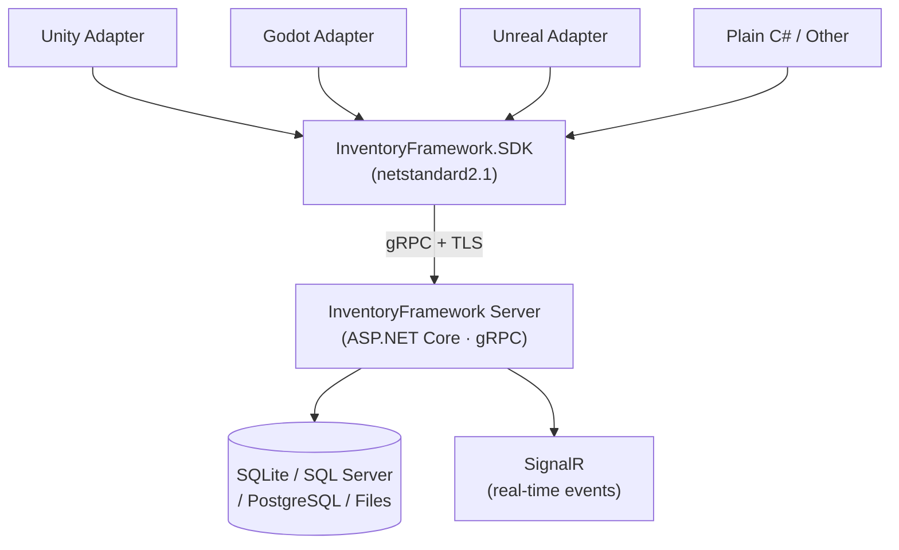

# InventoryFramework

[](https://www.nuget.org/packages/InventoryFramework.SDK)
[](https://www.nuget.org/packages/InventoryFramework.UnityAdapter)
[](https://www.nuget.org/packages/InventoryFramework.GodotAdapter)
[](https://www.nuget.org/packages/InventoryFramework.UnrealAdapter)
[](mailto:mbaltuncay99@gmail.com)

**Server-authoritative inventory and crafting backend for Unity, Godot, and Unreal Engine.**

One server, three engines, zero vendor lock-in. Define your items in JSON, run the server, connect from any engine in under 10 minutes.

> Full documentation: **[docs/](docs/)**

---

## Why not just use Unity's built-in systems?

Unity's inventory solutions — whether built-in or from the Asset Store — are client-side. That works fine for single-player. The moment you add multiplayer, leaderboards, or a second platform, you hit the same wall every time: the data lives on the client, players can modify it, and syncing it across engines is a custom project of its own.

InventoryFramework takes a different approach:

- **All state lives on your server.** Players cannot modify their own inventory outside your game logic. No client-side hacks, no save file editing.
- **One backend, any engine.** The same server talks to Unity, Godot, and Unreal simultaneously. Switch engines mid-project or ship on multiple platforms without rewriting your inventory logic.
- **Self-hosted.** Your player data never touches a third-party service. No per-MAU pricing, no outage dependencies, no terms-of-service changes that break your game.
- **Drop-in ready.** Item definitions are plain JSON files. The server runs with `dotnet run`. You don't need to write a single line of backend code to get started.

---

## How it works



The SDK handles the gRPC transport, retry logic, and response mapping. Engine adapters wrap the SDK in engine-friendly patterns (MonoBehaviour lifecycle for Unity, Node signals for Godot, etc.).

---

## Get it running in 10 minutes

### 1. Install the server

Contact [mbaltuncay99@gmail.com](mailto:mbaltuncay99@gmail.com) to obtain your licensed server binary, then run:

```bash
dotnet run --project InventoryFramework.Server
```

The server starts at `https://localhost:7289`.

### 2. Define your items

Create `Data/Items/items.json`:

```json
[
  { "id": "wood",  "displayName": "Wood",      "maxStackSize": 50, "weight": 1.0 },
  { "id": "sword", "displayName": "Iron Sword", "maxStackSize": 1,  "weight": 3.0,
    "hasDurability": true, "maxDurability": 100 }
]
```

### 3. Connect from your engine

Pick your adapter and install it via NuGet:

```bash
# Unity
dotnet add package InventoryFramework.UnityAdapter

# Godot
dotnet add package InventoryFramework.GodotAdapter

# Unreal
dotnet add package InventoryFramework.UnrealAdapter

# Plain C# / server-to-server
dotnet add package InventoryFramework.SDK
```

### 4. Create an inventory and add items

```csharp
var facade = new UnityInventoryFacade(new UnityInventoryConfiguration
{
    ServerAddress = "https://localhost:7289",
    ApiKey        = "sk-game-your-key",
    ActorId       = "player-001"
});

await facade.CreateDefaultInventoryAsync();
await facade.GrantItemsAsync(containerId, "wood", 10);

var snapshot = await facade.RefreshAsync();
Debug.Log($"Items in backpack: {snapshot.Containers[0].Slots.Count(s => !s.IsEmpty)}");
```

Same four lines work on Godot and Unreal — just swap the facade class name.

---

## Features

| | Demo | Pro | Enterprise |
|---|:---:|:---:|:---:|
| File-based persistence | ✓ | ✓ | ✓ |
| SQLite persistence | | ✓ | ✓ |
| SQL Server / PostgreSQL | | | ✓ |
| Unity · Godot · Unreal adapters | ✓ | ✓ | ✓ |
| Item affixes (rolled modifiers) | ✓ | ✓ | ✓ |
| Player progression / recipe unlock keys | | ✓ | ✓ |
| Real-time events via SignalR | ✓ | ✓ | ✓ |
| Source code | | ✓ | ✓ |
| Priority support | | | ✓ |

Licensing: `Demo` | `Pro` | `Enterprise` — contact [mbaltuncay99@gmail.com](mailto:mbaltuncay99@gmail.com)

---

## What's included

```
InventoryFramework.Server/          ASP.NET Core gRPC host
InventoryFramework.SDK/             Client library (netstandard2.1)
InventoryFramework.UnityAdapter/    Unity MonoBehaviour-friendly facade
InventoryFramework.GodotAdapter/    Godot Node-friendly facade
InventoryFramework.UnrealAdapter/   Unreal Engine facade
InventoryFramework.LicenseGenerator/ CLI for RSA key generation and license issuance
```

Domain, Application, Infrastructure, and Persistence layers follow Clean Architecture — the engine adapters and the server are both thin shells around the same core.

---

## Item affixes

Affixes are per-instance modifiers rolled onto individual item stacks — fire damage, move speed, crit chance, whatever your game needs. They're defined in JSON and travel all the way from the server through the SDK to the engine adapter without any extra mapping code.

```json
[
  { "id": "fire_damage", "displayName": "Fire Damage", "statKey": "damage", "minValue": 10, "maxValue": 50 }
]
```

```csharp
await facade.GrantItemsAsync(containerId, "sword", 1, affixes: new[]
{
    new ItemAffixRequest { AffixDefinitionId = "fire_damage", Value = 38.5f }
});
```

---

## Inventory operations

### Slot locking

Lock a slot to protect its contents from automated bulk operations (quick-store, auto-sort). Manual moves and crafting still work — locking is a player preference, not a security boundary.

```csharp
await facade.LockSlotAsync(containerId, slotIndex: 2, lockSlot: true);
// Slot 2 is now skipped by QuickStore and SortContainer
```

### Stack splitting

Split a stack into two within the same container. Optionally specify an explicit target slot.

```csharp
var result = await facade.SplitStackAsync(containerId, sourceSlotIndex: 0, amount: 5);
// Slot 0 keeps the remainder; result.DestinationSlotIndex tells you where the split landed
```

### Dropping items

Remove items from a slot and discard them. The server returns the item definition id and quantity so the game can optionally spawn a world drop.

```csharp
var result = await facade.DropItemsAsync(containerId, slotIndex: 0, amount: 3);
// result.DroppedItemDefinitionId — spawn a wood pickup at the player's position
```

### Auto-sort

Sort all unlocked slots in a container. Locked slots act as fixed anchors that the sort routes around.

```csharp
await facade.SortContainerAsync(containerId, sortMode: 0);  // 0 = ByNameAscending
                                                             // 1 = ByWeightDescending
                                                             // 2 = ByTagThenName
```

### Container slot restrictions

Equipment slots can be restricted to items with a specific tag. Attempts to place a mismatched item skip the slot automatically, or throw when the restriction is violated explicitly.

```json
{ "id": "helmet", "displayName": "Iron Helmet", "maxStackSize": 1, "weight": 3.0, "tags": ["helmet"] }
```

The server respects restrictions during `GrantItems`, `TransferItems`, `SplitStack`, and `SortContainer`.

---

## gRPC endpoints

| RPC | Description |
|---|---|
| `CreateInventory` | Creates a new inventory aggregate |
| `GetInventory` | Returns full inventory state including affixes, `IsLocked`, and `Restriction` per slot |
| `GrantItems` | Adds items with optional affixes (admin) |
| `TransferItems` | Moves items between containers |
| `QuickStoreItems` | Bulk-transfers matching stacks (skips locked slots) |
| `CraftItems` | Executes a recipe |
| `PreviewCraftItems` | Checks craftability without modifying state |
| `BrowseRecipes` | Lists recipes by category / station |
| `GetAvailableRecipes` | Returns craftable recipes given current inventory |
| `UnlockRecipeKey` / `RevokeRecipeKey` | Manage player progression keys |
| `GetPlayerProgression` | Returns all unlocked keys for an actor |
| `TradeItems` | Cross-inventory item transfer (admin) |
| `LockSlot` | Locks or unlocks a specific slot |
| `SplitStack` | Splits a stack into two slots within the same container |
| `DropItems` | Removes and discards items from a slot |
| `SortContainer` | Sorts unlocked slots by name, weight, or tag group |

All requests require an `x-api-key` header. Admin endpoints additionally require a key with `IsAdmin: true`.

---

## Documentation

| | |
|---|---|
| [Server Configuration](docs/server-configuration.md) | API keys, paths, persistence backends |
| [Item Definitions](docs/item-definitions.md) | JSON schema, durability, weight, tags |
| [Crafting & Recipes](docs/crafting.md) | Recipe format, partial crafting, unlock keys |
| [Player Progression](docs/progression.md) | Recipe unlock keys, grant and revoke |
| [Persistence](docs/persistence.md) | File, SQLite, SQL Server, PostgreSQL |
| [SDK Usage](docs/sdk-usage.md) | Plain C# client, DI, error handling |
| [Unity Integration](docs/unity-integration.md) | Installation, MonoBehaviour setup |
| [Godot Integration](docs/godot-integration.md) | Installation, Node setup |
| [Unreal Integration](docs/unreal-integration.md) | Installation, facade setup |
| [SignalR Events](docs/signalr-events.md) | Real-time inventory change notifications |
| [Testing Guide](docs/testing.md) | Running tests, test projects, writing new tests |
