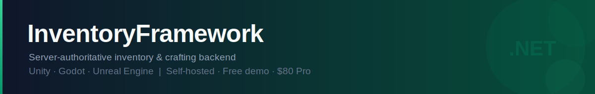
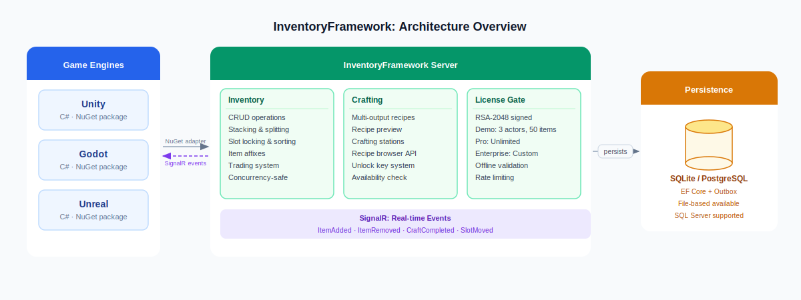

<div align="center">
  
</div>

<br>

<div align="center">

[](https://www.nuget.org/packages/InventoryFramework.SDK)
[](https://www.nuget.org/packages/InventoryFramework.UnityAdapter)
[](https://www.nuget.org/packages/InventoryFramework.GodotAdapter)
[](https://www.nuget.org/packages/InventoryFramework.UnrealAdapter)
[](https://github.com/b-altuncay/InventoryFramework/releases/latest)
[](mailto:mbaltuncay99@gmail.com)

**[Documentation](https://b-altuncay.github.io/InventoryFramework)** &nbsp;|&nbsp; **[Get a license](https://mbaltuncay.gumroad.com/l/qyeyym)** &nbsp;|&nbsp; **[Discussions](https://github.com/b-altuncay/InventoryFramework/discussions)**

</div>

---

## Why InventoryFramework?

Most inventory systems for game engines keep state on the client. That works for single-player, but once you add multiplayer, leaderboards, or a second target platform, you run into the same problems: players can tamper with client-side data, keeping two engines in sync requires custom code, and swapping engines mid-project means rewriting inventory logic from scratch.

InventoryFramework runs all inventory and crafting logic on a server you control:

- Item state is stored server-side, so players can't tamper with it. No memory editing, no save file manipulation.
- The same server talks to Unity, Godot, and Unreal. Add an engine later or switch mid-project without touching the backend.
- You self-host it. Player data stays on your own servers, no per-MAU costs or third-party dependencies.
- Getting started takes about 10 minutes. Item definitions are JSON files, the server starts with `dotnet run`.

<br>

<div align="center">
  
</div>

---

## Get it running in 10 minutes

### 1. Install via NuGet

```bash
# Unity
dotnet add package InventoryFramework.UnityAdapter

# Godot
dotnet add package InventoryFramework.GodotAdapter

# Unreal
dotnet add package InventoryFramework.UnrealAdapter

# Plain C# / server-to-server
dotnet add package InventoryFramework.SDK
```

### 2. Define your items

Create `Data/Items/items.json`:

```json
[
  { "id": "wood",  "displayName": "Wood",      "maxStackSize": 50, "weight": 1.0 },
  { "id": "sword", "displayName": "Iron Sword", "maxStackSize": 1,  "weight": 3.0,
    "hasDurability": true, "maxDurability": 100 }
]
```

### 3. Connect and add items

```csharp
var facade = new UnityInventoryFacade(new UnityInventoryConfiguration
{
    ServerAddress = "https://localhost:7289",
    ApiKey        = "sk-game-your-key",
    ActorId       = "player-001"
});

await facade.CreateDefaultInventoryAsync();
await facade.GrantItemsAsync(containerId, "wood", 10);

var snapshot = await facade.RefreshAsync();
Debug.Log($"Items in backpack: {snapshot.Containers[0].Slots.Count(s => !s.IsEmpty)}");
```

The same code works on Godot and Unreal; just swap the facade class name.

---

## Feature tiers

| | Demo | Pro | Enterprise |
|---|:---:|:---:|:---:|
| Server binary + SDK + engine adapters | ✓ | ✓ | ✓ |
| File-based persistence | ✓ | ✓ | ✓ |
| SQLite persistence | | ✓ | ✓ |
| SQL Server / PostgreSQL | | | ✓ |
| Unity, Godot, Unreal adapters | ✓ | ✓ | ✓ |
| Item affixes (rolled modifiers) | ✓ | ✓ | ✓ |
| Player progression & recipe unlock keys | | ✓ | ✓ |
| Real-time events via SignalR | ✓ | ✓ | ✓ |
| Max slots per container | 20 | Unlimited | Unlimited |
| Studio license | Single project | Single studio | Multi-studio |
| Support | Community | E-mail | Priority + SLA |
| **Pricing** | **Free** | **[$80 one-time](https://mbaltuncay.gumroad.com/l/qyeyym)** | **[Contact us](mailto:mbaltuncay99@gmail.com)** |

> Enterprise pricing is handled privately. [Email us](mailto:mbaltuncay99@gmail.com) with your studio name and use case.

---

## Documentation

| | |
|---|---|
| [Getting Started](getting-started.md) | First server run, item definitions, first request |
| [Server Configuration](server-configuration.md) | API keys, paths, persistence backends |
| [Item Definitions](item-definitions.md) | JSON schema, durability, weight, tags |
| [Crafting & Recipes](crafting.md) | Recipe format, partial crafting, unlock keys |
| [Player Progression](progression.md) | Recipe unlock keys, grant and revoke |
| [Persistence](persistence.md) | File, SQLite, SQL Server, PostgreSQL |
| [Deployment](deployment.md) | Docker, TLS, reverse proxy, env vars |
| [SDK Usage](sdk-usage.md) | Plain C# client, DI, error handling |
| [Unity Integration](unity-integration.md) | Installation, MonoBehaviour setup |
| [Godot Integration](godot-integration.md) | Installation, Node setup |
| [Unreal Integration](unreal-integration.md) | Installation, facade setup |
| [SignalR Events](signalr-events.md) | Real-time inventory change notifications |
| [Testing Guide](testing.md) | Running tests, test projects, writing new tests |

---

<div align="center">

Questions? Open a thread in **[Discussions](https://github.com/b-altuncay/InventoryFramework/discussions)** or email [mbaltuncay99@gmail.com](mailto:mbaltuncay99@gmail.com).

</div>
